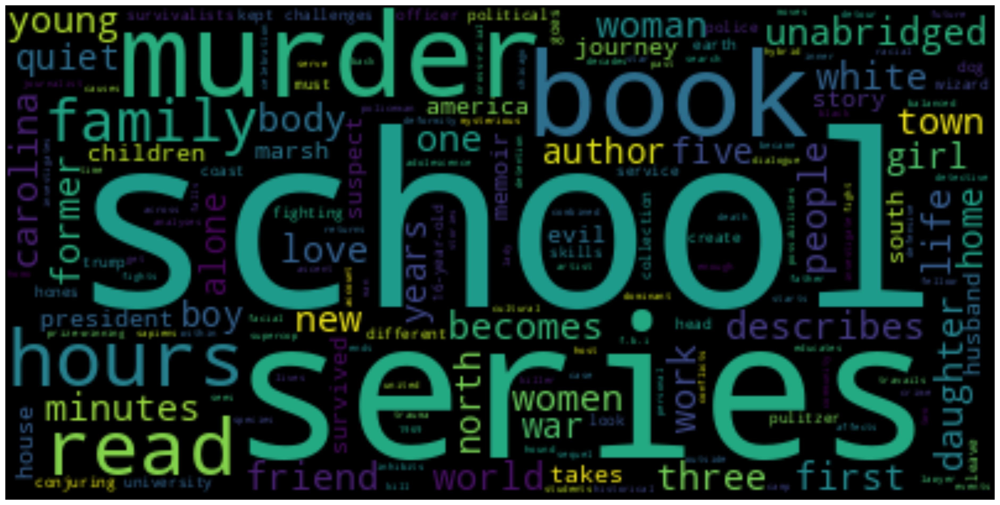

### Frequent words

This module is to get the most frequently used words in the latest NTY bestseller's listings.

You can get either of the `word` associated with their `frequencies` or the `WordCloud` generated from the frequencies.
As shown below:
###### Word Frequencies:
- 'school': 576
- 'series': 529
- 'murder': 493
- 'book': 486
- 'hours': 448
- 'read': 445
- 'family': 444
- 'unabridged': 417
- 'first': 410
- 'minutes': 409 
...
###### Word Cloud:

---
#### Usage
To use the frequency module
- import the module using: 
``from frequent_words import frequent_words``
- `frequent_words.get_frequencies_since(datetime(2018, 2, 3))`  where datetime(yyyy, mm, dd) is the date to be specified, since when you'd require the frequencies from.
- `get_frequencies_word_cloud_since` will give you the `WordCloud` since the specified date, you can also set `figsize` and `dpi` The returned image will be saved as `freqwordcloud.png`
- `get_all_since` has the same parameters as the above function, but returns both the frequencies and saves the image